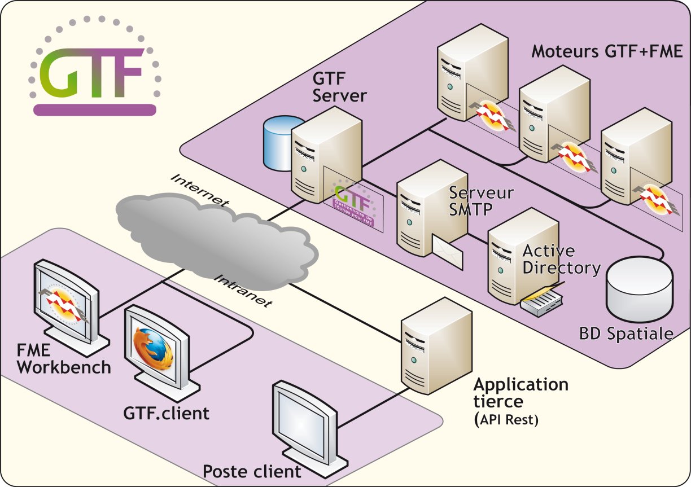

# Bienvenue dans GTF

GTF (Gestionnaire de Tâches pour FME) est une application 100% web qui permet de publier sur internet des traitements conçus avec FME et de les mettre à disposition d&#39;un grand nombre d&#39;utilisateurs. C&#39;est un outil de partage, de planification et de supervision de traitements FME.

GTF offre des fonctions d&#39;administration pour la création et la gestion des utilisateurs et l&#39;attribution des droits sur les traitements.

GTF est particulièrement bien adapté pour répondre à des besoins de :

-  conversion de fichiers
- extraction de données
- contrôle qualité
- génération de rapport
- gestion d&#39;alertes

GTF se compose d'une application cliente, d&#39;une API REST qui permet d&#39;exploiter GTF sous forme de service web et d&#39;une API Formulaire :

- GTF Client permet à l&#39;administrateur de publier des traitements préalablement conçus avec FME Workbench. Par cette interface, l&#39;administrateur gère les utilisateurs en leur attribuant des droits sur les traitements publiés, et peut également  s&#39;appuyer sur un annuaire MS-Active Directory pour assurer l&#39;authentification et la gestion des droits. Il dispose par ailleurs de fonctions de supervision et de consultation de statistiques. Les utilisateurs soumettent des demandes de traitements, chargent leurs propres données et téléchargent les résultats. Les traitements sont exécutés en mode asynchrone ce qui permet aux utilisateurs de continuer à travailler sans attendre la fin du traitement. Un e-mail avertit l&#39;utilisateur de la disponibilité du résultat. GTF Client permet également  de s&#39;abonner à un traitement à la fréquence souhaitée pour automatiser la production d&#39;un traitement.

- L&#39;API REST de GTF permet à n&#39;importe quelle application de faire appel aux services de GTF de manière transparente pour les utilisateurs. C&#39;est la solution idéale pour les développeurs souhaitant offrir leur propre interface graphique.

- L&#39;API Formulaire permet de mettre en forme le formulaire de saisie des paramètres en intégrant des composants (cartes open layer, arborescences de fichiers…)

 ## Les composants logiciels de GTF

L&#39;architecture de GTF est constituée de plusieurs composants logiciels.

| Composants | Description |
| --- | --- |
| GTF Client | Applications web  permettant aux utilisateurs l&#39;accès aux services GTF |
| Apache HTTPD | Logiciel serveur HTTP. |
| PHP | Langage de programmation |
| PostgreSQL | Système de gestion de base de données relationnelle utilisé pour le stockage des informations : demandes de traitements, traitements publiés, droits des utilisateurs...   |
| PYCRON | Service Windows assurant l&#39;exécution de tâches planifiées. |
| GTF Engine | GTF Engine désigne le moteur de GTF, la partie logicielle capable d&#39;exécuter les traitements FME. GTF exploite au minimum un moteur GTF. Les moteurs supplémentaires permettent de répartir la charge sur plusieurs process ou machines. L&#39;ajout de moteurs supplémentaires et soumis à l&#39;acquisition des licences correspondantes.  |
| FME | Logiciel FME Professional Edition ou supérieure en licence fixe ou flottante. FME ne fait pas partie du logiciel GTF, mais il est indispensable à son fonctionnement. |

 
 
ajout
