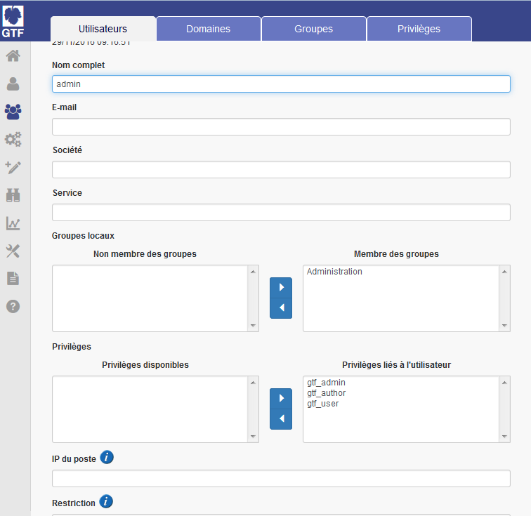
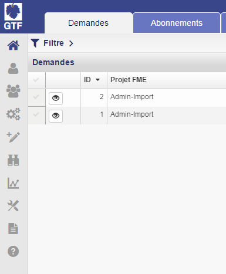

# Initialisation du compte Administrateur

## Configuration du compte administrateur

Le compte administrateur, défini en phase d'installation par la variable 'AppAdmin', dispose initialement des privilèges vitis\_user et vitis \_admin.

La configuration du compte administrateur permet l'attribution des privilèges d'administration spécifiques à GTF, c'est à dire gtf\_admin :

• Se connecter à GTF avec le compte administrateur

• Mode Utilisateurs \> onglet Utilisateur, éditer le compte administrateur et lui attribuer les privilèges gtf\_admin. Attribuer à l'administrateur les autres privileges gtf\_author et gtf\_user.

• Associer le compte courant au groupe Administration

• Mettre à jour

• Se déconnecter

 

En savoir plus sur les privilèges

## Test de Connexion du compte administrateur

A ce stade de l'initialisation, le compte administrateur peut se connecter à GTF ( https://\<serveur\>/gtf) et accéder à l'intégralité des 10 modes de l'application.

Les 10 modes sont correctement affichés dans la barre de gauche :

 

Le compte administrateur peut procéder à une demande de traitement. Cette dernière restera en attente et ne sera pas exécutée.

  3 traitements sont intégrés dans GTF : Admin-Import, Admin-export et Vérification des formulaires.

Après avoir configuré le compte administrateur, procéder à l'installation du moteur GTF.

