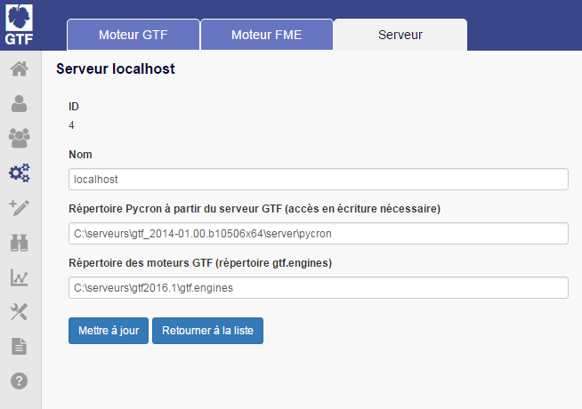
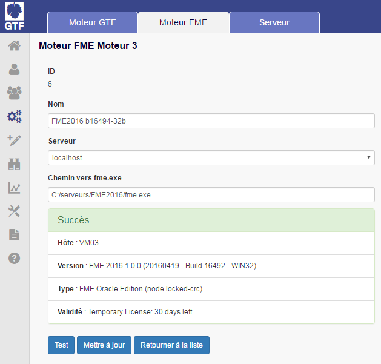
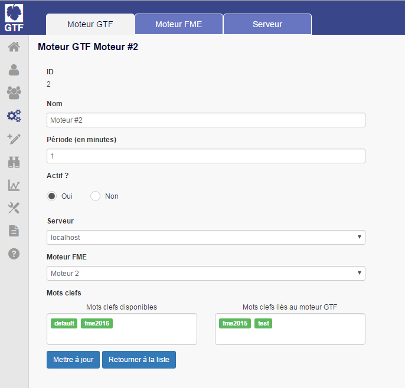
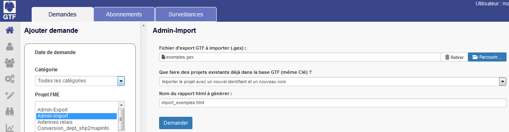
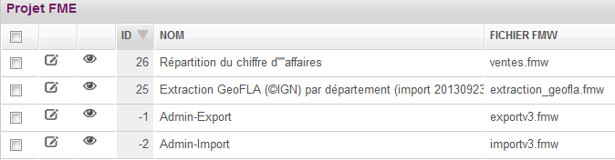

# Installation du moteur GTF

L'installation du moteur GTF se décline en 5 étapes :

- Installation de Pycron
- Installation du moteur GTF
- Configuration du moteur GTF
- Configuration du serveur SMTP
- Activation de la licence

 ## Installation de Pycron

Pycron est le programme qui permet aux utilisateurs de systèmes Windows d'exécuter automatiquement des scripts, des commandes ou des logiciels à une date et une heure spécifiées à l'avance. Dans GTF, il permet l'exécution des demandes GTF aux dates et heures spécifiées.

[Procédure d'installation de Pycron.](http://documentation.veremes.net/public/ressource/pycron_guide_installation.pdf#http://documentation.veremes.net/public/ressource/pycron_guide_installation.pdf)

### Configuration de Pycron

- Démarrer le service de Pyrcon

Démarrer le service de pycron en ligne de commande :

    sc start PyCron

 ### Test de l'installation de Pycron

Exécuter la commande suivante pour accéder à la liste des services de Windows : services.msc

Rechercher dans la liste des services disponibles, le service Pycron (Python Cron Service).

Vérifier que le service soit démarré et que le type de démarrage soit en mode Automatique.

 ### Déclaration du serveur Pyrcon dans GTF

Dans GTF, indiquer le répertoire d'installation du Pycron dans le Mode Configuration \> Configuration GTF\> Répertoire de pycron.

 **Test** : Cette opération rajoute un répertoire 'Log&' dans la fenêtre d'affichage des journaux du Mode Log.

 ## Installation du Moteur

Décompresser l'archive moteur\_gtf.zip, dans le répertoire d'installation au même niveau que les répertoires client et vas.

 
 Lors de la décompression de l'archive gtf.engines, l'administrateur doit penser à modifier manuellement le fichier de configuration de la base de données PostgreSQL pour autoriser la connexion de l'utilisateur scheduler à la base de données créée lors de l'installation de GTF. Dans le répertoire d'installation de PostgreSQL (répertoire data),  modifier à l'aide d'un éditeur de texte le fichier pg\_hba.conf en y insérant les lignes suivantes pour les deux connexions IPv4 et IPv6._

Immédiatement après « # IPv4 local connections » insérer la ligne :

        host<base de donnnées>u\_scheduler 127.0.0.1/32 trust

Immédiatement après « # IPv6 local connections » insérer la ligne :

        host<base de donnnées>u\_scheduler ::1/128 trust

_\<base de donnnées\> est le nom de la base de données créée en phase d'installation. (vitis par défaut)_

Redémarrer le service PostgreSQL.

## Configuration du moteur GTF

### Déclaration du serveur

La déclaration du serveur permet de définir les répertoires contenant l'ordonnanceur Pycron et le moteur GTF.

-Mode Moteur\> Onglet Serveur : Ajouter un serveur

-Nommer le serveur

-Définir le répertoire d'installation de Pycron.

-Définir le répertoire contenant le moteur GTF gtf.engines

-Cliquer sur Créer

 
 

### Déclaration d'un moteur FME

Un moteur FME est l'instance de FME en charge de l'exécution des projets. GTF permet d'exploiter différents moteurs hétérogènes. On peut ainsi exploiter un moteur FME 2015 en 32 bits et une instance de FME 2016 en 64 bits.

La première étape consiste à déclarer un moteur FME exploitable par GTF.

-Mode Moteurs \> Onglet Moteur FME : Ajouter un moteur FME

-Nommer le moteur et indiquer le chemin du moteur fme.exe.

-Associer le serveur désiré

-Cliquer sur Créer

 

 Il est conseillé de nommer le moteur FME en indiquant le numéro de version, le numéro de build et le nombre de bits. Par exemple : « FME2016 b16494-32b ».

 Le bouton 'Test' permet de vérifier la validité de la licence FME. Avec FME 2016, pour que la licence soit valide, copier le fichier de licence présent dans le répertoire C:\ProgramData\SafeSoftware\FME\Licenses) dans le répertoire \licenses du répertoire d'installation de FME2016.

### Déclaration de moteur GTF

On entend par Moteur GTF la capacité d'exploiter un moteur FME dans GTF. La création d'un moteur GTF permet d'associer à un serveur un moteur et de définir une période de déclenchement de l'activité spécifique. Un moteur GTF est associé à un seul moteur FME mais plusieurs moteurs GTF peuvent exploiter le même moteur FME.

L'ajout de moteurs GTF supplémentaires permet à l'administrateur d'appliquer une stratégie de traitement de projets en spécialisant par exemple certains moteurs et en permettant la parallélisation des traitements.

Dans le mode Moteurs \>Onglet Moteur GTF, le bouton « Ajouter un moteur GTF » ouvre le formulaire de création  de moteur GTF.

Attribuer un nom au moteur GTF et définir la période d'activité en minutes de ce dernier (période de déclenchement du moteur). On peut choisir de rendre inactif ce moteur, puis on sélectionne le serveur et le moteur FME à associer. Associer ensuite un ou plusieurs mots clés au moteur.

 

 Associer un ou plusieurs mots clés à un moteur permet à l'administrateur de mettre en place une stratégie de distribution des traitements sur plusieurs moteurs GTF : quand un utilisateur crée une demande de traitement, un moteur spécifique est spécifiquement attribué. Chaque moteur GTF est associé à un ou plusieurs mots clés. Chaque projet FME est ensuite associé à un mot clé. L'affiliation d'un projet à un moteur GTF se fait ainsi à partir de mots clés._L'administrateur peut choisir des mots clés existants et déjà affiliés à d'autres moteurs dans la partie de gauche 'Mots clés disponibles', ou saisir directement le nom d'un nouveau mot clé dans le bloc de droite 'Mot clé lié au moteur'. Un simple clic sur un mot clé disponible permet de le lier au moteur GTF.

 Il est recommandé de nommer le moteur GTF selon cette règle : ID (auto)\_ FME Version Service Pack. Par exemple : «  #3 FME 2013 SP 3 ».

 

Cliquer ensuite sur le bouton 'Créer' pour finaliser la création du moteur GTF

## Configuration du serveur SMTP

La phase de configuration du serveur SMTP est nécessaire à ce stade de l'initialisation, pour que l'administrateur puisse demander le fichier de licence GTF en envoyant un mail au service administratif de Veremes.

Dans le mode Configuration,configuration GTF, la section serveur SMTP permet de procéder à la déclaration du serveur SMTP.

## Activation du fichier de licence GTF

L'installation du fichier de licence GTF est la dernière étape du processus d'initialisation de GTF.

Dans le mode Configuration, la section Licence permet de demander un fichier de licence nécessaire pour activer les licences permanentes.

Le bouton « Demande de fichier de licence » permet d'envoyer au service administratif de Veremes une demande de génération de fichier de licence. Indiquer le numéro de licence fourni dans l'accusé de réception de votre commande, ainsi que l'adresse mail à laquelle le fichier doit être envoyé.

Une fois obtenu,  indiquer l'emplacement du fichier de licence délivré par Veremes dans le champ 'Fichier.txt', puis cliquer sur 'Activer'.

## Tests : Import de nouveaux traitements

A ce stade, pour s'assurer du bon fonctionnement de GTF, il est recommandé de procéder à l'import de nouveaux traitements. Pour cela, Veremes met à disposition sur son site de téléchargement des projets exemples au format .gex.

Le projet &#39;Admin\_Import&#39; (associé au groupe Administration et installé automatiquement lors de l'installation de GTF) permet l'import de nouveaux traitements stockés dans un fichier .gex. Au préalable, l'administrateur doit être associé au groupe Administration pour pouvoir exploiter ces deux projets.

Télécharger le fichier «exemples.gex»  sur notre site de téléchargement. [http://download.veremes.com](http://download.veremes.com/) (répertoire gtf/gex)

Se connecter à GTF (compte administrateur) puis ajouter une demande.

 

Choisir le traitement &quot;Admin-Import&quot; puis dans « Fichier d'export GTF à importer (.gex) : », cliquer sur « Parcourir » et sélectionner le fichier exemples.gex préalablement téléchargé. Définir ensuite le nom du rapport html à générer. Il indique la liste des projets importés, leurs clé et ID ainsi que le statut de l'importation : Inséré dans GTF, Mis à jour dans GTF ou Non mis à jour dans GTF.

Associer un ou plusieurs mots clés à un moteur permet à l'administrateur de mettre en place une stratégie de distribution des traitements sur plusieurs moteurs GTF : quand un utilisateur crée une demande de traitement, un moteur spécifique est spécifiquement attribué. Chaque moteur GTF est associé à un ou plusieurs mots clés. Chaque projet FME est ensuite associé à un mot clé. L'affiliation d'un projet à un moteur GTF se fait ainsi à partir de mots clés._Il est obligatoire d'insérer l'extension .html dans le champs Nom du rapport à générer._

_Le paramètre &quot;Que faire des projets existants déjà dans la base GTF (même Clé)&quot; indique à GTF s'il doit charger ou pas les projets déjà existants dans la base GTF et identifiés de façon unique  par l'attribut Clé (cet attribut est généré automatiquement et est associé de façon unique à chaque projet)._

- Si ce paramètre vaut &#39;Ne pas importer&#39; et que le fichier .gex contient un projet FME avec une clé déjà existante dans la base GTF, alors le fichier n'est pas chargé._
- Inversement, si ce paramètre vaut &#39;Remplacer les projets existants&#39;, alors les projets dont la clé existe déjà dans la base de données GTF seront écrasés._
- Choisir &#39;Importer le projet avec un nouvel identifiant et un nouveau nom&#39;, si le projet FME avec la même clé existe déjà en base et que vous souhaitez importer le même projet mais avec un nouveau nom. Le projet est renommé en étant suffixé par la chaîne &quot;(import date de l&#39;import)&quot;._

Cliquer  sur « Créer la demande ». La demande est prise en compte et se retrouve dans la file d'attente du moteur GTF.

S'assurer que la Demande ait bien été traitée en consultant le mode Supervision, puis retourner dans le mode Publication pour consulter la liste des traitements nouvellement importés.

 

3 nouveaux traitements sont désormais disponibles dans GTF.

## Import des traitements d'administration

Le projet 'Nettoyage des fichiers temporaires' est disponible sur notre site de téléchargement, via le projet admin.gex. Il permet les fonctions d&#39;administration suivantes :

- le nettoyage des fichiers temporaires stockés dans les répertoires temporaires de GTF et FME.

Pour importer ce fichier, procéder de la même manière que précédemment en téléchargeant sur le site [http://download.veremes.com](http://download.veremes.com/) (répertoire gtf/gex) le fichier admin.gex.

Se connecter ensuite à GTF et faire une demande du Traitement Admin-Import. Choisir le fichier admin.gex précédemment téléchargé.

Assurez-vous que dans le mode Publication,  ce nouveau traitement ait bien été importé :

Une fois le module GTF installé, l'administrateur peut procéder à la configuration spécifique de GTF en en définissant le compte public, et mettant en place une stratégie de sécurité utilisateur.

Il créé ensuite les utilisateurs et/ou les importe depuis un annuaire Active Directory.

